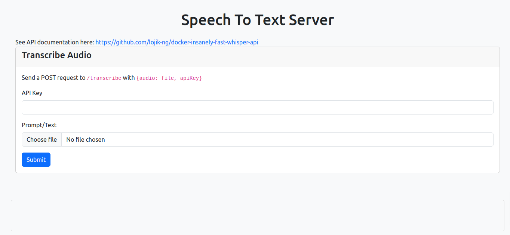

# docker-insanely-fast-whisper-api

docker API with Auth for insanely fast whisper

## Work in progress

Docker container for insanely-fast-whisper with API and UI.
Seeing that most AI projects require some python knowledge to deploy, i decided to use NodeJS/Javascript to create a simple to use AI Speech To Text API for whisper AI.

## Installation

```sh
git clone git@github.com:lojik-ng/docker-insanely-fast-whisper-api.git
cd docker-insanely-fast-whisper-api
mv server/keys.sample.json server/keys.json
docker build -t docker-insanely-fast-whisper-api .
docker run -d -it -p 2901:2901 --gpus all  --restart=unless-stopped -v .:/shared --name docker-insanely-fast-whisper-api docker-insanely-fast-whisper-api
```

You can now access the ui at `http://localhost:2901/`.

<h1 align="center">    
  </a>  
</h1>

### Endpoints/API

- Send a POST request to `http://localhost:2902/transcribe` with `{audio: blob or url to audio, apiKey: string}`
- Check server/index.html for example usage of the endpoints

### API Keys/Authentication

- Edit server/keys.json in the cloned repository anytime to add or remove API keys.

### Logging

- logs are rotated daily and can be found in /logs folder of the cloned repository.
- Logs are never purged. You'll need to manually purge the logs.
- Access logs, error logs etc are lumped together

### Features

- Requires GPU. I tested with Nvidia GPU (Cuda).
- API is written in NodeJS so should be easy for JS devs to modify. Check `server/index.js`.
- Authentication: You can add as many users and ban users just by editing the `server/keys.json` file.
- Logging: It logs all user requests, errors etc.

## Credits

- This software uses libraries from the [FFmpeg](http://ffmpeg.org) project under the [LGPLv2.1](http://www.gnu.org/licenses/old-licenses/lgpl-2.1.html)
- This software uses [insanely-fast-whisper](https://github.com/Vaibhavs10/insanely-fast-whisper)
